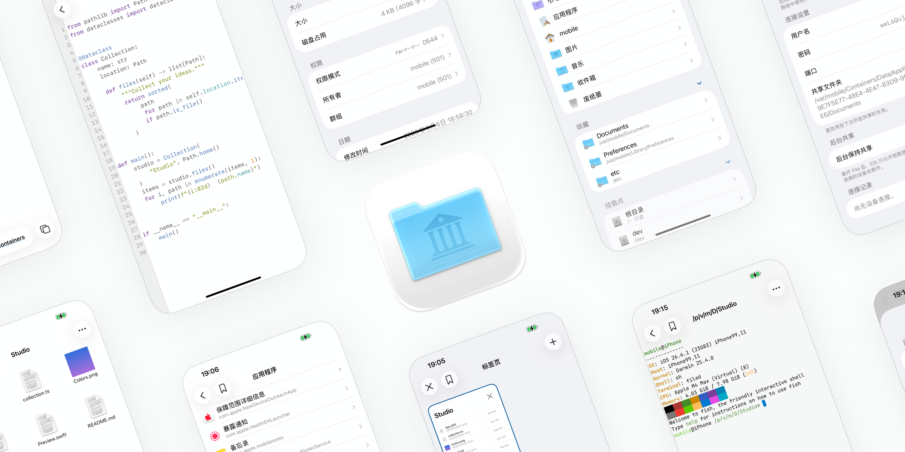

<p align="center">
  <a href="README.md">English</a> |
  <a href="README_zh-Hans.md">简体中文</a>
</p>

# Fila

Browse, organize, and edit files on your iPhone or iPad. Install Fila on a supported system environment to access system files with root privileges.



## Install

On a supported device, add the OwnGoal Studio repository in Sileo, Zebra, or another package manager:

**[Add to Sileo](sileo://source/https://apt.owngoal.dev)** · [apt.owngoal.dev](https://apt.owngoal.dev/)

Packages are also on [GitHub Releases](https://github.com/owngoal-dev/Fila/releases). Choose the file that matches how you install apps.

| Installation | Package | File access |
| --- | --- | --- |
| [roothide](https://github.com/roothide) bootstrap | `iphoneos-arm64e` `.deb` | Root access |
| Rootless bootstrap (`/var/jb`) | `iphoneos-arm64` `.deb` | Root access |
| TrollStore | `Fila_<version>.tipa` | Files the `mobile` user can reach |
| AltStore, SideStore, or Sideloadly | `Fila_<version>.ipa` | Fila’s own files and files you import |

Requires iOS 15 or later. Root access needs the `.deb` on a supported system environment. The `.tipa` and `.ipa` do not include it. The `.ipa` is built without the privileged, Applications and Music modules, so it contains no private API.

When sideloading, provision the same App Group for Fila and its Files extension.

## Features

- **Organize**: Copy, move, rename, and delete files. Deleted items go to Trash by default, where you can restore them. Keep folders open in tabs and return to saved or recently visited locations through Favorites and Recents.
- **Search**: Find files and folders by name. Search does not look inside file contents.
- **Apps**: Browse installed apps and open their bundle or data folder when your installation allows it.
- **View and edit**: Edit text with syntax highlighting and property lists. Preview images and PDFs, play audio and video, inspect binaries in hex, and read Mach-O details. Browse the Music library.
- **Archives**: Browse and extract ZIP, TAR, 7z, and RAR. Create ZIP and TAR archives; ZIP can be password-protected.
- **Share**: Import files and photos, download from a URL, share with other apps, or publish a folder over the network through a browser or WebDAV client.
- **Files app**: On iOS 16 or later, open Fila documents from the Files app. Files cannot use Fila’s root access.
- **Terminal**: On a supported device, run an executable or open a shell in the current folder.
- **Deletion protection**: Fila blocks deletion of key system folders by default.

Available folders and actions depend on how you install Fila.

## Using Fila

Tap a folder to browse it or a file to open it. Touch and hold an item for Copy, Move, Rename, and Properties. Use Select to work with several items at once.

Deleted items go to Trash by default. Open Trash and choose Put Back to restore an item. To change the default deletion behavior, open Settings → Move to Trash. Delete Permanently and Empty Trash cannot be undone.

To share a folder with another device, open Settings → File Sharing. Choose a folder, set a user name and password, and turn on sharing. On the other device connected to the same network, open the displayed address in a browser or WebDAV client and sign in.

On iOS 16 or later, Settings → Files App Folder manages the folder shown in the Files app.

## Links

Use `fila://` links in Shortcuts or other apps to open a folder, file, or screen. The destination must be reachable in your Fila installation. These links navigate or inspect; they do not modify or delete files.

| Link | Opens |
| --- | --- |
| `fila:///var/mobile/Documents` | The Documents folder |
| `fila://open?path=/var/mobile` | The specified folder |
| `fila://open?path=/var/mobile&tab=new` | The folder in a new tab |
| `fila://reveal?path=/etc/hosts` | The folder that contains the file |
| `fila://view?path=/etc/hosts` | The file in its viewer |
| `fila://info?path=/etc/hosts` | The file’s properties |
| `fila://search?query=hosts` | A name search starting at `/` |
| `fila://search?query=hosts&path=/etc` | A name search within `/etc` |
| `fila://app?bundle=com.example.thing` | The app’s bundle folder |
| `fila://app?bundle=com.example.thing&container=data` | The app’s data folder |
| `fila://apps` | Applications |
| `fila://settings` | Settings |

## Build from Source

```sh
make packages         # roothide and rootless .deb, TrollStore .tipa, and sideload .ipa
make deb              # roothide .deb
make deb-rootless     # rootless .deb
make tipa
make ipa
```

Contributor notes are in [AGENTS.md](AGENTS.md).

## License

Fila is available under the [MIT License](LICENSE).

The `.deb` packages are not for the App Store.

Join the community on [Discord](https://discord.gg/vqhDEep2mN).
